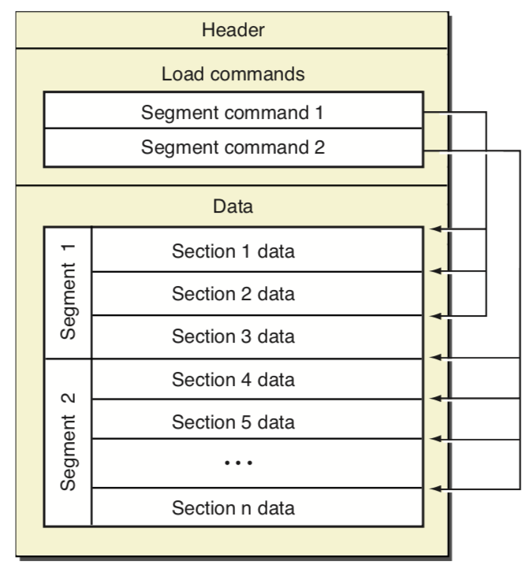
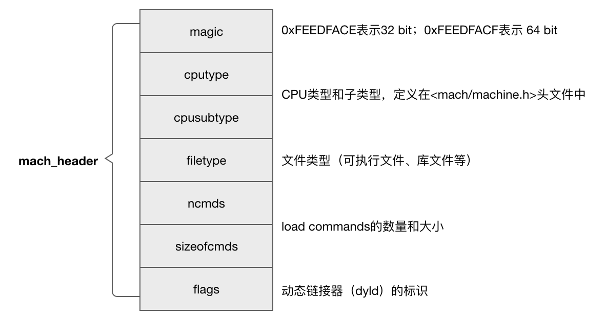
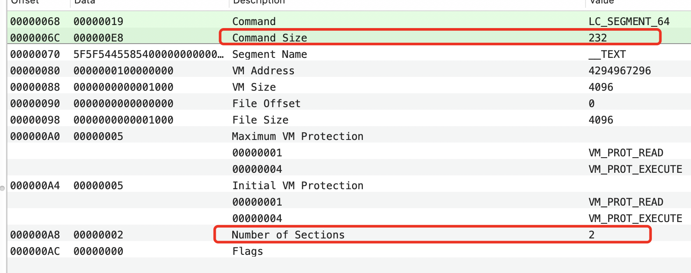
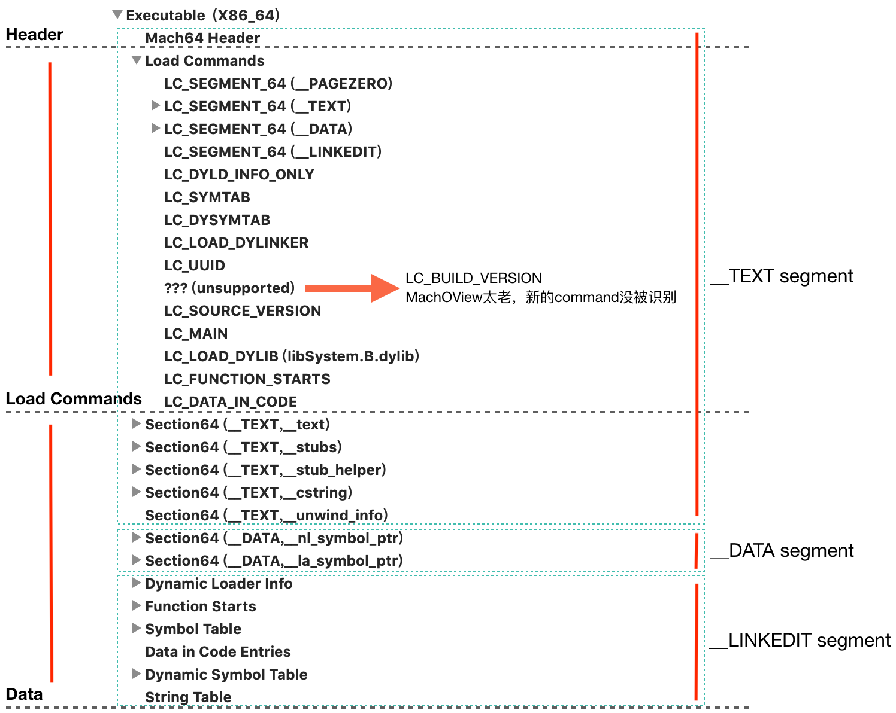

# Mach-O 学习小结（一）

最近学习了一下 Mach-O ,这里做个笔记记录，整理思路，加深理解。

[第一章](https://www.jianshu.com/p/fa5666308724) 描述了 Mach-O 文件的基本结构；  
[第二章](https://www.jianshu.com/p/92b4f611170a) 概述了符号，分析了符号表（symbol table）。  
[第三章](https://www.jianshu.com/p/9e4ccd3cb765) 探寻动态链接。

## 结构分析

关于 Mach-O 的文件格式，在网上常常看到如下这张图，出自官方文档《OS X ABI Mach-O File Format Reference》：



通过这张图，可以看到，从布局上，Mach-O 文件分为三个部分：Header、Load Commands、Data。但这张图过于简略，信息不完善，可能会让人困惑。先简单分析 Header 和 Load Commands 的结构吧！

### Header 的结构

32位和64位分别对应了不同的结构，但大同小异，这里以64位为例。

[mach-o/loader.h](https://opensource.apple.com/source/xnu/xnu-4903.221.2/EXTERNAL_HEADERS/mach-o/loader.h) 的`struct mach_header` 定义了 Header 的结构：

``` c
struct mach_header_64 {
    uint32_t magic;           /* mach magic number identifier */
    cpu_type_t cputype;       /* cpu specifier */
    cpu_subtype_t cpusubtype; /* machine specifier */
    uint32_t filetype;        /* type of file */
    uint32_t ncmds;           /* number of load commands */
    uint32_t sizeofcmds;      /* the size of all the load commands */
    uint32_t flags;           /* flags */
    uint32_t reserved;        /* reserved */
};
```

从图中可以看出，Header的结构是固定的，size固定为32 bytes(64位架构)  

每个字段的意思，如下：



filetype，描述了二进制文件的类型，包括了十来个有效值，常打交道的包括：

``` c
#define MH_OBJECT      0x1    // 中间目标文件，例如.o文件
#define MH_EXECUTE     0x2    // 可执行文件
#define MH_DYLIB       0x6    // 动态链接库
#define MH_DYLINKER    0x7    // 动态链接器
```

flags 是杂项，通常它包含的信息用于为动态链接器服务，告诉后者如何工作。

### Load Commands 的结构

Load Commands 可以被看作是一个 command 列表，紧贴着 Header，所以它的 file offset 是固定的：0x20（上面说的header的size为32 bytes，即0x20）。一共有哪些 load commands 呢？Load commands 由内核定义，不同版本的 command 数量不同，本文所参考的[内核](https://opensource.apple.com/source/xnu/xnu-4903.221.2/EXTERNAL_HEADERS/mach-o/loader.h)，一共定义了 50+ load commands，它们的 type 是以LC\_为前缀常量，譬如 LC\_SEGMENT、LC\_SYMTAB 等。

每个 command 都有独立的结构，但所有 command 结构的前两个字段是固定的：

``` c
struct load_command {
    uint32_t cmd;      /* type of load command */
    uint32_t cmdsize;  /* total size of command in bytes */
};
```

第一个字段指定了类型，第二个字段指定了大小，确保它能被正确解析。

这里只讲其中的一个 load command ，LC\_SEGMENT\_64，因为它和 segment、section 有关；命令格式如下：

``` c
struct segment_command_64 { /* for 64-bit architectures */
    uint32_t   cmd;         /* LC_SEGMENT_64 */
    uint32_t   cmdsize;     /* includes sizeof section_64 structs */
    char       segname[16]; /* segment name */
    uint64_t   vmaddr;      /* memory address of this segment */
    uint64_t   vmsize;      /* memory size of this segment */
    uint64_t   fileoff;     /* file offset of this segment */
    uint64_t   filesize;    /* amount to map from the file */
    vm_prot_t  maxprot;     /* maximum VM protection */
    vm_prot_t  initprot;    /* initial VM protection */
    uint32_t   nsects;      /* number of sections in segment */
    uint32_t   flags;       /* flags */
};
```

它描述了文件映射的两大问题：从哪里来（`fileoff`、`filesize`）、到哪里去（`vmaddr`、`vmsize`）；它还告诉了内核该区域的名字（`segname`，即 segment name），以及该区域包含了几个 section（`nsects`），以及该区域的保护级别（`initprot`、`maxprot`）。

* 每一个 segment 的 VP (Virtual Page) 都根据 `initprot` 进行初始化，initprot 指定了如何通过 **读/写/可执行** 初始化页面的保护级别；segment 的保护设置可以动态改变，但是不能超过 maxprot 中指定的值（在 iOS 中，+x(可执行) 和+w(可写) 是互斥的）；initprot、maxprot 的值均用八进制表示（1=r，2=w，4=x）
* flags 是杂项标志位
* vmsize 并不等于 filesize，对于 4KB 大小的 VP，vmsize 是 4K 的倍数；换句话说，vmsize 一般大于 segment 的实际大小


对于 segment 而言，有了这些信息，其结构其实就足够清晰了，但是如何知道其中各个 sections 的具体位置和 size 呢？

对于 LC\_SEGMENT\_64 而言，如果其`nsects`字段大于 0，其命令后面还会紧接着挂载`nsects`个描述 section 的信息，这些信息是结构体`section_64`的列表，`section_64`结构体定义如下：

``` c
struct section_64 { /* for 64-bit architectures */
    char      sectname[16];    /* name of this section */
    char      segname[16];     /* segment this section goes in */
    uint64_t  addr;            /* memory address of this section */
    uint64_t  size;            /* size in bytes of this section */
    uint32_t  offset;          /* file offset of this section */
    uint32_t  align;           /* section alignment (power of 2) */
    uint32_t  reloff;          /* file offset of relocation entries */
    uint32_t  nreloc;          /* number of relocation entries */
    uint32_t  flags;           /* flags (section type and attributes)*/
    uint32_t  reserved1;       /* reserved (for offset or index) */
    uint32_t  reserved2;       /* reserved (for count or sizeof) */
    uint32_t  reserved3;       /* reserved */
};
```

结构体`section_64`可以看做 section header，它描述了对应 section 的具体位置，以及要被映射的目标虚拟地址。

回头再看`segment_command_64`的`cmdsize`字段，它的数值是`segment_command_64`的 size 大小，加上紧接在 command 后面的所有`section_64`结构体的大小。

举个例子，如果 segment 含有 2 个 section，那么对应的 `segment_command_64` 的 cmdsize 值为：

``` objc
72（segment_command_64本身大小） + 2 * 80（section_64的大小） = 232 bytes
```



这里应该明白 segment 和 section ：Mach-O 本没有 segment，有了 LC\_SEGMENT\_64，于是有了 segment。

### Data的结构

和 Header、Load Commands 不同，Mach-O 对 Data 区域没有任何公共的结构上的定义。它里面盛装的字节本来没有意义，有了 LC\_SEGMENT\_64 以及其他的 load commands，一切才开始有了意义。


## Mach-O 的结构

结合上面的内容，通过一个具体的 case，综述一下 Mach-O 的结构。写一个简单的 C 文件如下：

``` c
#include <stdio.h>

int main(void) {
    printf("Hello, world!\n");
    return 0;
}
```

执行gcc main.c，得到可执行文件 a.out，使用 MachOView 工具查看，得到如下结构：



注意左右标红的部分，可以得到的信息：

* 一共包括三个 segment：\_\_TEXT、\_\_DATA、\_\_LINKEDIT
* segment 的内容范围并非一定在 Data 区内（譬如 \_\_TEXT segment）
* 并非每一个 segment 都由 section 组成（譬如 \_\_LINKEDIT segment）

为啥 \_\_TEXT 的地址范围从 0 开始而非从 \_text 这个 section 开始呢？《OS X ABI Mach-O File Format Reference》是这么说的：

> The header and load commands are considered part of the first segment of the file for paging purposes. In an executable file, this generally means that the headers and load commands live at the start of the __TEXT segment because that is the first segment that contains data.

一个典型的 Mach-O 结构图的更清晰描述应该是这个样子：


## 总结

这篇文章主要说明了 Mach-O 文件的结构，以及三种结构体`mach_header_64 `、`segment_command_64 `、`section_64 `的结构及其意义: 

``` c
//解释 Header
struct mach_header_64 { 
    uint32_t magic;           /* mach magic number identifier */
    cpu_type_t cputype;       /* cpu specifier */
    cpu_subtype_t cpusubtype; /* machine specifier */
    uint32_t filetype;        /* type of file */
    uint32_t ncmds;           /* number of load commands */
    uint32_t sizeofcmds;      /* the size of all the load commands */
    uint32_t flags;           /* flags */
    uint32_t reserved;        /* reserved */
};

//解释 segment
struct segment_command_64 { /* for 64-bit architectures */
    uint32_t   cmd;         /* LC_SEGMENT_64 */
    uint32_t   cmdsize;     /* includes sizeof section_64 structs */
    char       segname[16]; /* segment name */
    uint64_t   vmaddr;      /* memory address of this segment */
    uint64_t   vmsize;      /* memory size of this segment */
    uint64_t   fileoff;     /* file offset of this segment */
    uint64_t   filesize;    /* amount to map from the file */
    vm_prot_t  maxprot;     /* maximum VM protection */
    vm_prot_t  initprot;    /* initial VM protection */
    uint32_t   nsects;      /* number of sections in segment */
    uint32_t   flags;       /* flags */
};

//解释 section
struct section_64 { /* for 64-bit architectures */
    char      sectname[16];    /* name of this section */
    char      segname[16];     /* segment this section goes in */
    uint64_t  addr;            /* memory address of this section */
    uint64_t  size;            /* size in bytes of this section */
    uint32_t  offset;          /* file offset of this section */
    uint32_t  align;           /* section alignment (power of 2) */
    uint32_t  reloff;          /* file offset of relocation entries */
    uint32_t  nreloc;          /* number of relocation entries */
    uint32_t  flags;           /* flags (section type and attributes)*/
    uint32_t  reserved1;       /* reserved (for offset or index) */
    uint32_t  reserved2;       /* reserved (for count or sizeof) */
    uint32_t  reserved3;       /* reserved */
};
```
