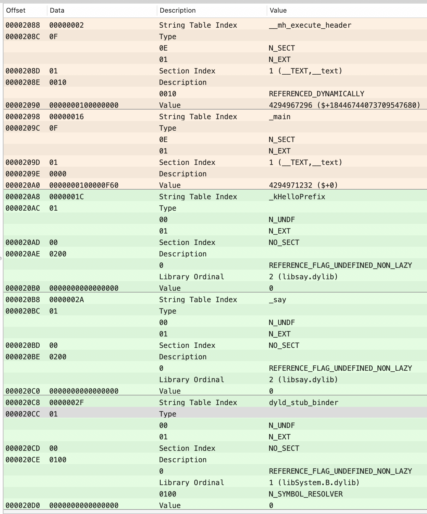

# Mach-O 学习小结（三）

最近学习了一下 Mach-O ,这里做个笔记记录，整理思路，加深理解。  
附上下文所用[demo](https://github.com/whlpkk/Mach)

## 概述

[第一章](https://www.jianshu.com/p/fa5666308724) 描述了 Mach-O 文件的基本结构；  
[第二章](https://www.jianshu.com/p/92b4f611170a) 概述了符号，分析了符号表（symbol table）。  
[第三章](https://www.jianshu.com/p/9e4ccd3cb765) 探寻动态链接。  
[第四章](https://www.jianshu.com/p/c9445935b055) 分析fishhook。   
[第五章](https://www.jianshu.com/p/bad714ea8df7) 分析BeeHive。    
[第六章](https://www.jianshu.com/p/a174f17a9d82) App启动时间。


### RIP-relative 寻址

本文所在环境的系统架构是 x86-64，很多指令的寻址方式是 RIP-relative 寻址。虽然笔者汇编不甚熟悉，但是为了后续分析和阅读方便，还是得花些笔墨整理一下 RIP-relative 寻址相关内容。

> RIP 的全拼是：Relative Instruction Pointer

按照笔者的粗浅理解，基于 RIP 计算目标地址时，目标地址等于当前指令的下一条指令所在地址加上偏移量。简单来说，若看到如下二进制的反汇编内容：

```
0000000000001fcd  jmpq  0x2d(%rip)
0000000000001fd3  nop
```

则第一行代码 jmpq 的跳转目标地址是：0x1fd3 + 0x2d = 0x2000。

### 间接寻址

除了 RIP-relative 寻址，也得提一下间接寻址。间接寻址是相对于直接寻址而言的，即目标地址并不是计算得到的地址值，而是该地址值存储的数据。

简单来说，如果看到如下二进制的反汇编内容：

```
0000000000001fcd  jmpq  *0x2d(%rip)
0000000000001fd3  nop
```

> 对于间接寻址，反汇编代码中，地址值前有一个*

则第一行代码 jmpq 的跳转目标地址是 0x2000 (0x1fd3 + 0x2d) 里存储的地址，并非 0x2000 本身。


### 几个基本概念

在展开分析之前，先罗列本文高频出现的一些概念：

* 镜像：xnu、dyld 都将 Mach-O 文件看作镜像（image），本文所指的镜像即 Mach-O 文件
* 目标文件：即只编译未链接的可重定位文件
* dylib：动态链接库，在 ELF 生态中，常被称作「共享对象」，或者「共享文件」，本文称作 dylib，或者 dylibs
* dyld：dyld 是 Apple 生态操作系统（macOS、iOS）的动态链接器，本文直接使用 dyld 指代 Mach-O 的动态链接器

### 引子

静态链接比较简单，原理上也容易理解，实践上却存在很多问题，典型问题有两点：

* 极大浪费磁盘和内存空间
* 给程序的更新、部署和发布带来很多麻烦

稍微描述一下第二点。比如程序 Program1 所使用的 Lib.o 是由一个第三方厂商提供的，当该厂商更新了 Lib.o 的时候，那么 Program1 的开发者就要拿到最新版的 Lib.o，然后将其与 Program1.o 链接后，将新的 Program1 整个发布给用户。即一旦程序有任何模块的更新，整个程序就得重新链接、发布给用户。

### 动态链接

动态链接是对这两个问题的解决方案。所谓动态链接，简单地讲，就是不对那些组成程序的目标文件进行链接，等到程序要运行时才进行链接。也就是说，把链接这个过程推迟到运行时再进行，这就是动态链接（Dynamic Linking）的基本思想。

动态链接的背景和基本思想理解起来蛮容易的，但实践中需要处理不少问题。本文以一个具体的 case 引出 Mach-O 动态链接中值得我们关心的问题。

首先，有一个文件 say.c：

``` c
#include <stdio.h>

char *kHelloPrefix = "Hello";

void say(char *prefix, char *name)
{
    printf("%s, %s\n", prefix, name);
}
```

该模块很简单，定义了两个符号：常量字符串`kHelloPrefix`，以及函数`say`。使用 gcc 把 say.c 编译成 dylib：

```
$ gcc -fPIC -shared say.c -o libsay.dylib
# 生成 libsay.dylib
```

再定义一个使用 say 模块的 main.c：

``` c
void say(char *prefix, char *name);
extern char *kHelloPrefix;

int main(void)
{
    say(kHelloPrefix, "Jack");
    return 0;
}
```

把 main.c 编译成可重定位中间文件（只编译不链接）：

``` 
$ gcc -c main.c -o main.o
# 生成可重定位中间文件：main.o
```

此时的 main.o 是不可执行的，需要使用链接器 ld 将 sayHello 链接进来：

```
$ ld main.o -macosx_version_min 10.14 -o main.out -lSystem -L. -lsay
# -macosx_version_min 用于指定最小系统版本，这是必须的
# -lSystem 用于链接 libSystem.dylib
# -lsay 用于链接 libsay.dylib
# -L. 用于新增动态链接库搜索目录
# 生成可执行文件：main.out
```

这样就生成了可执行文件 main.out，执行该文件，打印「Hello, Jack」。此时若使用`xcrun dyldinfo -dylibs`查看 main.out 的依赖库，会发现有两个依赖库：

```
$ xcrun dyldinfo -dylibs main.out
attributes     dependent dylibs
                /usr/lib/libSystem.B.dylib
                libsay.dylib
```

这两个动态库的依赖在 Mach-O 文件中对应两条 type 为LC_LOAD_DYLIB的 load commands，如下：


> `LC_LOAD_DYLIB`命令的顺序和 ld 的链接顺序一致。

`LC_LOAD_DYLIB`命令参数描述了 dylib 的基本信息，结构比较简单：

``` c
struct dylib {
    union lc_str  name;             // dylib 的 path
    uint32_t timestamp;             // dylib 构建的时间戳
    uint32_t current_version;       // dylib 的版本
    uint32_t compatibility_version; // dylib 的兼容版本
};
```

无论是静态链接，还是动态链接，符号都是最重要的分析对象；来看看 main.out 的符号表（symbol table）：



可以看到，symbol table 中有三个未绑定的外部符号：`_kHelloPrefix`、`_say`、`dyld_stub_binder`；本文接下来对 Mach-O 文件结构的分析将围绕这 3 个符号进行展开。

## 结构分析

先将 Mach-O 中与动态链接相关的结构给罗列出来：

* Section
    * \_\_TEXT \_\_stubs
    * \_\_TEXT \_\_stub\_helper
    * \_\_DATA \_\_nl\_symbol\_ptr
    * \_\_DATA \_\_got
    * \_\_DATA \_\_la\_symbol\_ptr
* Load Command
    * LC\_LOAD\_DYLIB
    * LC\_SYMTAB
    * LC\_DYSYMTAB
* Symbol Table
* Dynamic Symbol Table
* Dynamic Loader Info
    * Binding Info
    * Lazy Binding Info

涉及若干个 sections、load commands，以及 indirect symbol table、dynamic loader info 等。其中`LC_LOAD_DYLIB`这个命令上文已经提到，它描述了镜像依赖的 dylibs。`LC_SYMTAB`定义的符号表（symbol table）是镜像所用到的符号（包括内部符号和外部符号）的集合，[第一章](https://www.jianshu.com/p/fa5666308724)对该命令和符号表有详细描述，本文不再赘述。

### Dynamic Symbol Table

每一个可执行的镜像文件，都有一个 symbol table，由`LC_SYMTAB`命令定义，包含了镜像所用到的所有符号信息。那么 indirect symbol table 是一个什么东西呢？本质上，indirect symbol table 是 index 数组，即每个条目的内容是一个 index 值，该 index 值（从 0 开始）指向到 symbol table 中的条目。Indirect symbol table 由`LC_DYSYMTAB`定义（Load Command），后者的结构是一个`dysymtab_command`结构体，详见[dysymtab_command](https://opensource.apple.com/source/xnu/xnu-4903.221.2/EXTERNAL_HEADERS/mach-o/loader.h.auto.html)，该结构体内容非常丰富，目前我们只需要关注`indirectsymoff`和`nindirectsyms`这两个字段：

``` c
struct dysymtab_command {
    uint32_t cmd;           /* LC_DYSYMTAB */
    uint32_t cmdsize;       /* sizeof(struct dysymtab_command) */

    // ...

    uint32_t indirectsymoff; /* file offset to the indirect symbol table */
    uint32_t nindirectsyms;  /* number of indirect symbol table entries */

    // ...
};
```

`indirectsymoff`和`nindirectsyms`这两个字段定义了 indirect symbol table 的位置信息，每一个条目是一个 4 bytes 的 index 值。

Indirect symbol table 的结构还是蛮容易理解的，但其存在的意义是啥？先别急，后面会讲到，总之它是为`__stubs`、`__got`等 section 服务的。

上文 main.out 的 indirect symbol table 可使用 MachOView 查看，一共包括 5 个条目：


### __text 里的外部符号

回到上文提到的 main.out，查看 main.out 代码段的反汇编内容下：


上述是 main 函数的反汇编代码，注意标红的两行，这两行的指令分别引用了`_kHelloPrefix`和`_say`符号；这两个符号未绑定，如果是静态链接，这俩处的地址值是指向符号；但此处是动态链接，符号目标地址值分别指向的是偏移 0x99 和 0x09，本文所在环境，采用的 PC 近址寻址，所以`_kHelloPrefix`和`_say`的目标地址分别是：

```
_kHelloPrefix 的目标虚拟地址 = 0x100000F6F（下一行指令的虚拟地址） + 0x00000099 = 0x100001008
_say 的目标虚拟地址 = 0x100000F85 + 0x00000009 = 0x100000F8E
```

`0x100001008`和`0x100000F8E`分别对应 main.out 中的哪个结构呢？答案是 section(\_\_DATA \_\_got) 和 section(\_\_TEXT \_\_stubs)，查看这两个 section 的地址和内容：


Mach-O 的代码段对 dylib 外部符号的引用地址，要么指向到`__got`，要么指向到`__stubs`。什么时候指向到前者，什么时候指向到后者呢？

站在逻辑的角度，符号有两种：数据型和函数型；前者的值指向到全局变量/常量，后者的值指向到函数。在动态链接的概念里，对这两种符号的绑定称为：non-lazy binding、lazy binding。对于non-lazy binding，在程序运行前（链接加载时）就会被绑定；对于lazy binding（函数型符号），在符号被第一次使用时（运行时）绑定，类似于懒加载。

### section(\_\_DATA \_\_got)

对于程序段`__text`里的代码，对数据型符号的引用，指向到了`__got`；可以把`__got`看作是一个表，每个条目是一个地址值。这里以64位举例，每个条目是一个64位的地址，即每个条目8字节。

在符号绑定（binding）前，`__got`里所有条目的内容都是 0，当镜像被加载时，dyld 会对`__`got每个条目所对应的符号进行重定位，将其真正的地址填入，作为条目的内容。换句话说，`__got`各个条目的具体值，在加载期会被 dyld 重写，这也是为啥这个 section 被分配在 \_\_DATA segment 的原因。

问题来了，dyld 是如何知道`__got`中各个条目对应的符号信息（譬如符号名字、目标库等）呢？[第一章](https://www.jianshu.com/p/fa5666308724)已经提到过，每个 segment 由`LC_SEGMENT`命令定义，该命令后的参数描述了 segment 包含的 section 信息，是谓 section header，对应结构体（x86\_64架构）是section\_64：

``` c
struct section_64 { /* for 64-bit architectures */
    char      sectname[16];    /* name of this section */
    char      segname[16];     /* segment this section goes in */
    // ...
    uint32_t  reserved1;       /* reserved (for offset or index) */
    uint32_t  reserved2;       /* reserved (for count or sizeof) */
    uint32_t  reserved3;       /* reserved */
};
```

对于`__got`、`__stubs`、`__nl_symbol_ptr`、`__la_symbol_ptr`这几个 section，其reserved1描述了该 list 中条目在 indirect symbol table 中的偏移量。

举个栗子，本文的 main.out 中的`__got`的 section header 的reserved1字段值为 2。


因为每个条目有8字节，图中可以看到，size位16，即可算出，`__got`它有2个条目。
第一条条目对应的符号 index 是 indirect symbol table 中的第 2 个（下标从0开始）的值。 再对应symbol table 中的 index 的符号；有点绕口，用伪代码表示，main.out 的`__got`的第一个条目对应的符号是：

```
__got[0]->symbol = symbolTable[indirectSymbolTable[__got.sectionHeader.reserved1]]
// -> __got.sectionHeader.reserved1 == 2
// -> indirectSymbolTable[2] == 2
// -> symbolTable[2] = Symbol(_kHelloPrefix)
// -> __got[0]->symbol = Symbol(_kHelloPrefix)

同理
__got[1]->symbol = symbolTable[indirectSymbolTable[__got.sectionHeader.reserved1 + 1]]
// -> __got.sectionHeader.reserved1 + 1 == 3
// -> indirectSymbolTable[3] == 4
// -> symbolTable[2] = Symbol(dyld_stub_binder)
// -> __got[0]->symbol = Symbol(dyld_stub_binder)
```

算是把`__got`讲清楚了，总之一句话，`__got`为 dyld 服务，用来存放 non-lazy 符号的最终地址值。

现在该说说`__stub`。

### section(\_\_TEXT \_\_stubs)

对于程序段`__text`里的代码，对函数型符号的引用，指向到了`__stubs`。和`__got`一样，`__stubs`也是一个表，每个表项是一小段`jmp`代码，称为「符号桩」。和`__got`不同的是，`__stubs`存在于 \_\_TEXT segment 中，所以其中的条目内容是不可更改的。

查看`__stubs`里的反汇编内容：


```
$ otool -v main.out -s __TEXT __stubs
main.out:
Contents of (__TEXT,__stubs) section
0000000100000f8e	jmpq	*0x84(%rip)
```

来看看`jmp`指令跳到哪里去，这里使用的间接寻址，所以下一条指令的地址为真正的地址值储存在 0x100001018 中。

```
这条指令的机器码为 0xFF2584000000 ，占6 bytes 。 这条指令的地址为 0x100000f8e
所以下条指令的地址为 0x100000f8e + 6 = 0x100000f94
0x100001018 = 0x100000f94 + 0x84(偏移)
```

0x100001018是哪个部分？答案是 section(\_\_DATA \_\_la\_symbol\_ptr)。

### section(\_\_DATA \_\_la\_symbol\_ptr)

查看`__la_symbol_ptr`的内容：


所以`__stubs`第一个 stub 的 jump 目标地址是 0x100000FA4。该地址坐落于 section(\_\_TEXT \_\_stub\_helper)。

### section(\_\_TEXT \_\_stub\_helper)

看看`__stub_helper`里的内容：


`__stubs`第一个 stub 的 jump 目标地址在第 6 行；这几条汇编代码比较简单，可以看出，代码最终会跳到第 3 行；之后该何处何从？

不难计算，第 3 行跳转目标地址是 0x100001010 (0x100000FA3 + 0x6D)存储的内容，0x100001010 在哪里呢？0x100001010 坐落于 section(\_\_DATA \_\_got)，通过上图可知指向了`dyld_stub_binder`。

> `dyld_stub_binder`是一个函数，为啥它被当做一个 non-lazy symbol 处理，这是因为它是所有 lazy binding 的基础，所以有些特殊。

`dyld_stub_binder`也是一个函数，定义于[dyld\_stub\_binder.S](https://opensource.apple.com/source/dyld/dyld-635.2/src/dyld_stub_binder.s.auto.html)，由 dyld 提供。

Lazy binding symbol 的绑定工作正是由 `dyld_stub_binder` 触发，通过调用 dyld::fastBindLazySymbol 来完成。

再看一下第 1 行，第一行加载的内存地址是 0x100001000 (0x100000F9B + 0x65)，0x100001000 在 section(\_\_DATA \_\_nl\_symbol\_ptr)。

### section(\_\_DATA \_\_nl\_symbol\_ptr)

按惯例，查看`__nl_symbol_ptr`里的内容：


啥是`__nl_symbol_ptr`？和`__got`类似，`__nl_symbol_ptr`也是用来存储 non-lazy symbol 绑定后的地址。只是`__got`是为`__text`代码段中的符号服务的，而`__nl_symbol_ptr`不是。

### Lazy Binding 分析

上文结合 main.out 实例，对 Mach-O 与动态链接相关的结构做了比较全面的分析。Non-lazy binding 比较容易理解，这里稍微对如上内容进行整合，整体对 lazy binding 基本逻辑进行概述。

对于`__text`代码段里需要被 lazy binding 的符号引用（如上文 main.out 里的\_say），访问它时总会跳转到 stub 中，该 stub 的本质是一个 jmp 指令，该 stub 的跳转目标地址坐落于`__la_symbol_ptr`。

首次访问\_say时：

1. `_say`对应的`__la_symbol_ptr`条目内容指向到`__stub_helper`
2. `__stub_helper`里的代码逻辑，通过各种辗转最终调用`dyld_stub_binder`函数
3. `dyld_stub_binder`函数通过调用 dyld 内部的函数找到`_say`符号的真实地址
4. `dyld_stub_binder`将地址写入`__la_symbol_ptr`条目
5. `dyld_stub_binder`跳转到`_say`符号的真实地址

之后再次访问`_say`时，stub 里的 jmp 指令直接跳转符号的真实地址，因为该地址已经被写到`__la_symbol_ptr`条目中。

这里只是简单的讲解了部分，推荐文章 [iOS Lazy Bind 你真的弄懂了吗？](http://www.zyiz.net/tech/detail-99942.html)

