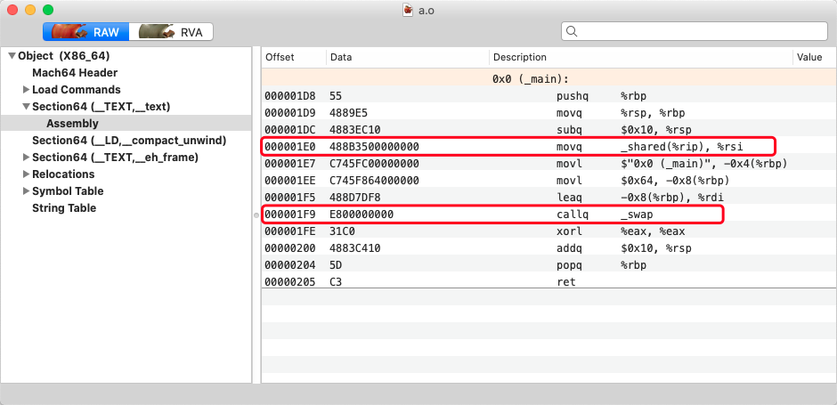
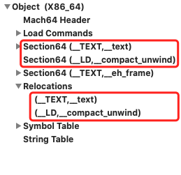
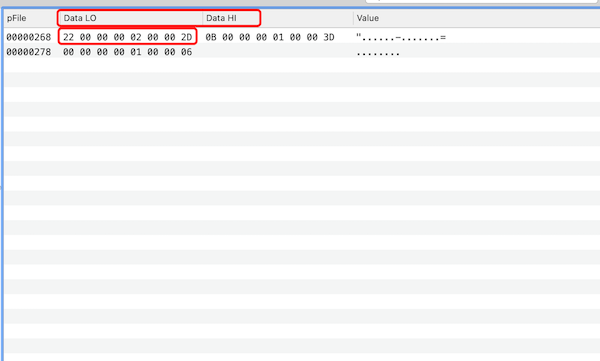
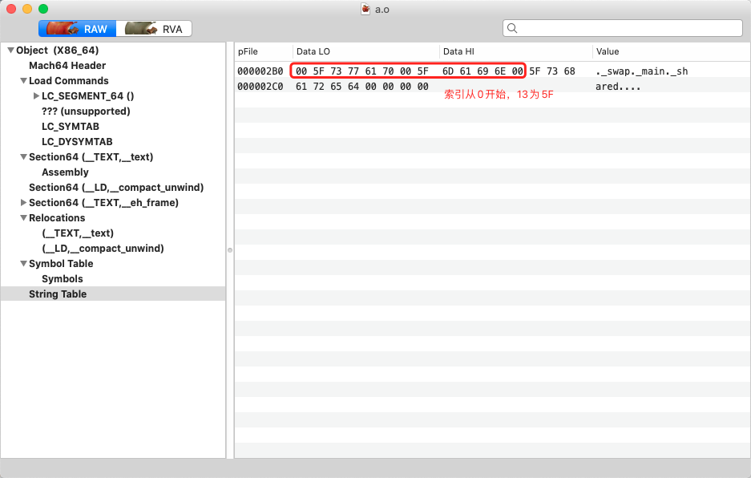
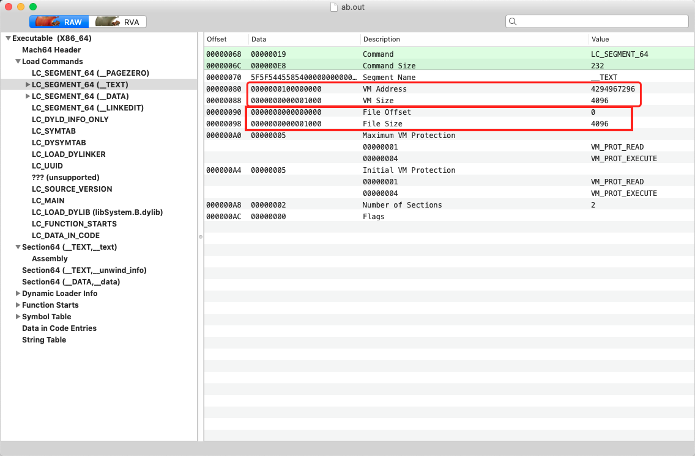
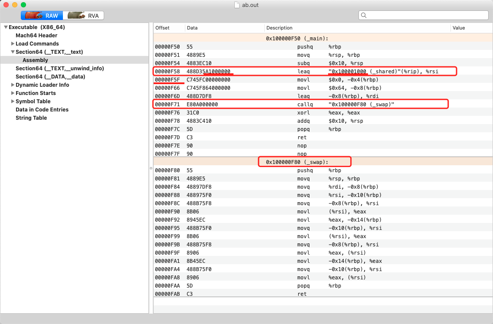

# Mach-O 学习小结（二）

最近学习了一下 Mach-O ,这里做个笔记记录，整理思路，加深理解。  
附上下文所用[demo](https://github.com/whlpkk/Mach)

## 概述

[第一章](https://www.jianshu.com/p/fa5666308724) 描述了 Mach-O 文件的基本结构；  
[第二章](https://www.jianshu.com/p/92b4f611170a) 概述了符号，分析了符号表（symbol table）。  
[第三章](https://www.jianshu.com/p/9e4ccd3cb765) 探寻动态链接。  
[第四章](https://www.jianshu.com/p/c9445935b055) 分析fishhook。   
[第五章](https://www.jianshu.com/p/bad714ea8df7) 分析BeeHive。    
[第六章](https://www.jianshu.com/p/a174f17a9d82) App启动时间。


本文的核心主题是静态链接，这一部分会对静态链接的内容做一个概述；在介绍链接之前，有必要先理清两个基本概念：符号、模块。

### 符号 & 模块

先说符号（symbol）。计算机世界里的符号概念起源于汇编，在汇编之前，远古大神的代码都是机器代码，机器代码充满了各种各样的数值，这些数值描述着指令、操作数、地址值；可以想到，全是数值的机器代码可读性非常糟糕；对于地址值而言，当程序变更时，地址值就得重新计算，这种操作实在过于黑暗，于是先驱者发明了汇编语言，使用符号来帮助记忆，如下：

``` 
jmp foo
...
foo:
  addl $4, %ecx
```

`jmp`符号表示跳转指令，`foo`符号描述子程序的地址；无论`foo`前插入还是减少了代码，程序员无需关心它的具体地址值，汇编器在汇编时会自动计算，极大解放生产力。

对于表示地址值的符号而言，可以把它理解为键值对，key 是符号，value 是地址值。在之后的计算机发展中，「符号」表达的意思基本上没有变化。

再说模块。稍有规模的现代项目源码，常被按照功能或性质进行划分，分别形成不同的功能模块，不同的模块之间按照层级结构或其他结构来组织。譬如，在 C 语言，若干个变量和函数组成一个模块，存放在一个.c的源码文件中，然后这些源代码文件按照目录结构来组织。

> 对于 Objective-C 项目，每个.m或者.mm文件构成一个模块。

大规模软件往往拥有成千上万个模块，这些模块相互依赖又相互独立。软件模块化有很多好处，譬如更易理解、重用等；对于编译器而言，其好处是每个模块可以单独编译，改变部分代码无需重新编译整个程序。

当一个程序被切割成多个模块后，现代编译器会对每个模块进行单独编译，为每一个模块生成中间文件。这些中间文件终究会被组合形成一个单一的可执行文件。

将程序各个模块的中间文件组合形成一个单一的可执行文件并不是一件容易的事情，因为模块间往往会互相依赖，或者说它们之间存在通信。因此，从编译器的角度看，模块之间如何组合的问题可以归结为处理模块间通信的问题。对于静态语言 C/C++ 而言，模块间的通信方式有两种：一种是模块间的函数调用，另外一种是模块间的变量访问；函数访问需知道目标函数的地址，变量访问也须知道目标变量的地址，所以这两种方式都可以归结为一种方式：模块间符号的引用。

### 静态链接

所谓静态链接，其本质是把程序各个模块的中间文件粘在一起，拼装成一个整体；换句话说，以模块的中间文件为输入，产生一个新的 Mach-O 文件（往往是可执行文件）。

静态链接主要过程包括：

* 地址和空间分配（Address and Storage Allocation）
* 符号决议（Symbol Resolution）
* 重定位（Relocation）

其中最核心是「重定位」过程。静态链接的重定位是围绕符号进行的，搞清楚了 Mach-O 文件中的符号，也就搞清楚了静态链接。

接下来的重心是对中间文件以及可执行文件的符号进行分析。

## 中间文件的符号分析

Mach-O 的文件类型有很多种（详见[mach-o/loader.h](https://opensource.apple.com/source/xnu/xnu-4903.221.2/EXTERNAL_HEADERS/mach-o/loader.h) 里以MH\_为前缀的 type 宏），常见的有：

* MH_OBJECT: 中间文件
* MH_EXECUTE: 可执行文件

上文多处提到「中间文件」，它其实就是一种`MH_OBJECT`类型的 Mach-O 文件，还常被称作「中间目标文件」「可重定位文件」，通常以`.o`为后缀，

使用下面两个源代码文件 a.c 和 b.c 作为例子展开分析：

``` c
/* a.c */
extern int shared;
void swap(int *a, int *b);
int main() {
    int a = 100;
    swap(&a, &shared);
    return 0;
}

/* b.c */
int shared = 42;
void swap(int *a, int *b) {
    int temp = &a;
    &a = &b;
    &b = temp;
}
```

从代码中可以看到，b.c 总共定义了两个全局符号，一个是变量`shared`，另外一个是函数`swap`；a.c 里面定义了一个全局符号`main`；后者引用了前者的俩符号。

使用 gcc 将这俩文件分别编译成目标文件 a.o 和 b.o :

```
$ gcc -c a.c b.c
# 生成 a.o 和 b.o
```

使用 MachOView 工具查看 a.o 的 \_\_TEXT \_\_text 的反汇编内容:



图中使用红框标记了 a.o 中的两处符号引用，分别对应 movq 操作和 callq 操作：

* `48 8B35 00000000`: 其中`48`是 movq 的操作码，`00000000`描述`_shared`的符号值（地址值）
* `E8 00000000`: 其中`E8`是 callq 的的操作码，`00000000`描述`_swap`的符号值（地址值）

> gcc编译器中的符号名，通常都含有_前缀。

可以看到，在 a.o 的代码段，该符号对应的地址值都被置为0。问题来了，编译器对中间文件进行链接时，如何知道该对哪些指令进行地址调整呢？这些指令的哪些部分要被调整呢？又该如何调整呢？

Relocation Symbol Table 正是解决这个问题的。

### Relocation Symbol Table

在每个可重定位的 Mach-O 文件中，有一个叫重定位（Relocation）的区域，专门用来保存这些和重定位相关的信息。

某个 section 如果内含需要被重定位的字节，就会有一个 relocation table 与此对应：



在[第一章](https://www.jianshu.com/p/fa5666308724)里介绍过 section 的结构（相关结构体定义于[mach-o/loader.h](https://opensource.apple.com/source/xnu/xnu-4903.221.2/EXTERNAL_HEADERS/mach-o/loader.h)中的 `section_64`），其中有两个字段描述了其对应的relocation table：

* `reloff`: relocation table 的 file offset
* `nreloc`: relocation table 的 entry 数量

Relocation table可以看作是一个 relocation entry 的数组，每个 relocation entry 占 8 个字节：

对应结构体是[relocation\_info](https://opensource.apple.com/source/xnu/xnu-4903.221.2/EXTERNAL_HEADERS/mach-o/reloc.h):

``` c
struct relocation_info {
    int32_t   r_address;      /* offset in the section to what is being relocated */
    uint32_t  r_symbolnum:24, /* symbol index if r_extern == 1 or section ordinal if r_extern == 0 */
              r_pcrel:1,      /* was relocated pc relative already */
              r_length:2,     /* 0=1 byte, 1=2 bytes, 2=4 bytes, 3=8 bytes */
              r_extern:1,     /* does not include value of sym referenced */
              r_type:4;       /* if not 0, machine specific relocation type */
};
```

对这几个字段稍作说明，也可查看[苹果官方定义](https://developer.apple.com/documentation/kernel/relocation_info?language=occ)：

* `r_address`表示相对于 section 的偏移量
* `r_length`表示需要被 relocation 的字节范围， 0=1 byte,  1=2 bytes,  2=4 bytes,  3=8 bytes
* `r_pcrel`表示地址值是否是 PC 相对地址值
* `r_extern`标记该符号是否是外部符号
* `r_symbolnum`，index 值，对于外部符号，它描述了符号在 symbol table 中的索引（从0开始）；如果是内部符号，它描述了符号所在的 section 的索引（按照LC\_SEGMENT load commands加载顺序排序，范围是1~255）。
* `r_type`，符号类型

这里还是以刚才的 a.o 为例：





```
这里解析第一个元素，从第二幅图可以看到 Data 值分别为 22 00 00 00 和 02 00 00 2D (小端模式)，小端模式即低地址为在前，高地址为在后
转换为阅读习惯(大端模式)为 00 00 00 22 和 2D 00 00 02 ，即图1中的 Data 列数据，这里是MachOView自动做了处理。
 
00 00 00 22   低4字节，对应r_address，表示在对应section偏移为 0x22，也就是说在__Text,__text section中偏移为0x22的位置。 
2D 00 00 02   高4字节，先看低位的24位(r_symbolnum:24)，值为 00 00 02，即 2
2D 转为 2进制  0010 1101  
第25位(r_pcrel:1)，值为 1，表示该地址是相对于PC的相对地址 
26~27位(r_length:2)，值为 0b10，即2，也就是4 bytes
28位(r_extern:1)，值为 1，表示该符号是外部符号
29~32位(r_type:4)，值为 0b0010。

这里因为r_extern 值为1，表示是外部符号，所以这里的r_symbolnum表示在symbol表中的索引（从0开始）。
根据后面的Symbol Table可以找到索引为2的符号，也就是_swap(查找过程见下文)。
综上所述，也就是会在__Text,__text section中偏移为0x22的位置起始，替换4字节。替换为外部符号_swap
```

### Symbol Table

从上文的`r_symbolnum`可以看出，`relocation_info`并未完整描述符号信息，它只是告诉链接器哪些指令需要调整地址。符号的具体信息（包括符号名等）在 symbol table 中：


链接器是通过 LC\_SYMTAB 这个 load command 找到 symbol table 的，关于 load command，在[第一章](https://www.jianshu.com/p/fa5666308724)里有过介绍，此处不再赘述；LC\_SYMTAB 对应的 command 结构体如下：

``` c
struct symtab_command {
    uint32_t cmd;     /* LC_SYMTAB */
    uint32_t cmdsize; /* sizeof(struct symtab_command) */
    uint32_t symoff;  /* symbol table offset */
    uint32_t nsyms;   /* number of symbol table entries */
    uint32_t stroff;  /* string table offset */
    uint32_t strsize; /* string table size in bytes */
};
```

这个命令告诉了链接器 symbol table 和 string table 的相关信息；`symtab_command`这个结构体比较简单，`symoff`和`nsyms`指示了符号表的位置和条目，`stroff`和`strsize`指示了字符串表（String Table）的位置和长度。

每个 symbol entry 长度是固定的，其结构由内核定义，详见[nlist.h](https://opensource.apple.com/source/xnu/xnu-4903.221.2/EXTERNAL_HEADERS/mach-o/nlist.h)：

``` c
struct nlist_64 {
    union {
        uint32_t n_strx;   /* index into the string table */
    } n_un;
    uint8_t  n_type;       /* type flag, see below */
    uint8_t  n_sect;       /* section number or NO_SECT */
    uint16_t n_desc;       /* see <mach-o/stab.h> */
    uint64_t n_value;      /* value of this symbol (or stab offset) */
};
```

结构体`nlist_64`（或`nlist`）描述了符号的基本信息，其中`n_un`、`n_sect`、`n_value`比较容易理解：

* `n_un`，符号的名字（在一个 Mach-O 文件里，具有唯一性），其值位在 String Table 中的索引值，String Table 实际是一个 char 类型的数组，即一个大字符串。根据`n_un`的值在 String Table中开始，到遇到 00 字节结束。
* `n_sect`，符号所在的 section index（有效值从 1 开始，最大为 255，同上文）
* `n_value`，符号的地址值（在链接过程中，会随着其 section 发生变化）

`n_type`和`n_desc`表达的意思稍微复杂点；都是多功能组合字段，主要参考[kernel/nlist_64](https://developer.apple.com/documentation/kernel/nlist_64/)。`n_type`是一个 8 bit的复合字段，由4种mask组成

* `N_STAB` (0xe0，即0b 1110 0000)，即最高三位，如果不为 0，表示这是一个与调试有关的符号，值意义类型详见参考。
* `N_PEXT` (0x10，即0b 0001 0000)，即第4位，若为 1，则表示该符号是有限全局范围(`__private_extern__`)，当静态链接时会清除`N_EXT`位的设置。
* `N_TYPE` (0x0e，即0b 0000 1110)，5~7位，定义了符号的类型（详细定义见参考）。
* `N_EXT ` (0x01，即0b 0000 0001)，第8位，若为1，表示符号为外部符号，即该符号要么定义在外部，要么定义在本地但是可以被外部使用。

`n_desc`可自行参考[kernel/nlist_64](https://developer.apple.com/documentation/kernel/nlist_64/)。  

这里举个例子解释一下`n_un`怎么找到符号名，以上面符号表的截图中，`_shared`符号为例：


可以看到`n_un`的值为 0xD，即13。去 String Table 表中去查询：



可以看到，查询到的结果为：\_（0x5F）s（0x73）h（0x68）a（0x61）r（0x72）e（0x65）d（0x64）。从ASCII码查表即可得到结果，即我们这里的符号名`_shared`。

有了 relocation table 和 symbol table，链接器就与足够的信息进行链接处理了。

### 可执行文件的符号分析

先使用`ld`工具（静态链接器）对如上 a.o、b.o 进行链接，生成可执行文件：

``` sh
ld a.o b.o -macosx_version_min 10.14 -o ab.out -lSystem
# 生成可执行文件 ab.out
```

使用 MachOView 工具查看可执行文件 ab.out 。

在[第一章](https://www.jianshu.com/p/fa5666308724)里介绍过 load Commond 的结构，我们可以知道 \_\_Text segment 的虚拟基地址为 `4294967296，即 0x 100000000`。相对于文件的偏移量为 0 。



代码段 \_\_TEXT \_\_text 的反汇编内容，如下：



图中红线部分分别是符号`_shared`和`_swap`对应的地址，链接前，a.o 中此两处的地址值均为0；在 ab.out 中，链接器根据 a.o 的 relocation table 的信息，对此两处地址进行了调整，将它们修改为有效地址。

我们分析修正后`_shared`和`_swap`所对应的文件偏移地址。

先看`_shared`，其所在指令的下一条指令相对于文件的偏移地址是 0x00000F5F，计算其虚拟内存地址 0x100000F5F。

```
虚拟内存地址 = 文件偏移量 - 所在segment的文件偏移量 + 所在segment的虚拟基地址
文件偏移量为 0x00000F5F， __Text segment 文件偏移量为0， 虚拟基地址 0x100000000。
可以算得 虚拟地址为 0x100000F5F。
```

指令相对偏移是 `0x A1 00 00 00（小端），即 0x000000A1`，相加计算得到的`_shared`符号的虚拟地址值等于 0x100001000（如上图所示）。


根据 Load Commonds 可以看到，0x100001000 落在 \_\_DATA segment 中。同上面的计算方法，计算出在文件中的偏移量为 0x00001000。

```
虚拟内存地址 = 文件偏移量 - 所在segment的文件偏移量 + 所在segment的虚拟基地址 
推导可得
文件偏移量 = 虚拟内存地址 - 所在segment的虚拟基地址 + 所在segment的文件偏移量
即         0x100001000 -  0x100001000(__DATA segment) + 0x1000(__DATA segment)
可以算得 文件偏移地址为 0x1000。
```

根据文件偏移地址 0x1000 对应的是 ab.out 中的 \_\_DATA \_\_data :


该地址所存储的值 0x0000002A 恰好等于 42（b.c中赋值的42）。

对于`_swap`符号也是类似，其所在指令的下一条指令相对于文件的偏移地址是 0x00000F76，计算得虚拟地址 0x100000F76，相对偏移是 0x0000000A，计算得到目标虚拟地址等于 0x100000F80，恰好是`_swap`函数的起始地址。

另外一个需要注意到的事实是：ab.out 中再也没有 relocation table 了，这不难理解，ab.out 中的符号都得到了重定位，relocation table 已经没有存在的必要了。

Relocation table 没有了，symbol table 呢？令人震惊的是，ab.out 的 symbol table 中条目更多了，先不讨论多余的。

现在的问题是：ab.out 中`_main`、`_shared`、`_swap`这几个 symbol entry 存在的意义是啥？

我的理解是：如果从程序正常运行的角度来看，这几个符号没啥用。事实上，使用 strip 工具可以将这几个 symbol entry 从 symbol table 中抹掉。

## 总结

本章主要介绍了：

1、 在[第一章](https://www.jianshu.com/p/fa5666308724)里介绍过 section 的结构（相关结构体定义于[mach-o/loader.h](https://opensource.apple.com/source/xnu/xnu-4903.221.2/EXTERNAL_HEADERS/mach-o/loader.h)中的 `section_64`），其中有两个字段描述了其对应的relocation table：

* `reloff`: relocation table 的 file offset
* `nreloc`: relocation table 的 entry 数量


2、 relocation table可以看作是一个 relocation entry 的数组，每个 relocation entry 占 8 个字节。某个 section 如果内含需要被重定位的字节，就会有一个 relocation table 与此对应：

对应结构体是[relocation\_info](https://opensource.apple.com/source/xnu/xnu-4903.221.2/EXTERNAL_HEADERS/mach-o/reloc.h):

``` c
struct relocation_info {
    int32_t   r_address;      /* offset in the section to what is being relocated */
    uint32_t  r_symbolnum:24, /* symbol index if r_extern == 1 or section ordinal if r_extern == 0 */
              r_pcrel:1,      /* was relocated pc relative already */
              r_length:2,     /* 0=1 byte, 1=2 bytes, 2=4 bytes, 3=8 bytes */
              r_extern:1,     /* does not include value of sym referenced */
              r_type:4;       /* if not 0, machine specific relocation type */
};
```

3、 symbol table ，链接器是通过 LC\_SYMTAB 这个 load command 找到 symbol table 的，关于 load command，在[第一章](https://www.jianshu.com/p/fa5666308724)里有过介绍，此处不再赘述；LC\_SYMTAB 对应的 command 结构体如下：

``` c
struct symtab_command {
    uint32_t cmd;     /* LC_SYMTAB */
    uint32_t cmdsize; /* sizeof(struct symtab_command) */
    uint32_t symoff;  /* symbol table offset */
    uint32_t nsyms;   /* number of symbol table entries */
    uint32_t stroff;  /* string table offset */
    uint32_t strsize; /* string table size in bytes */
};
```
这个命令告诉了链接器 symbol table 和 string table 的相关信息。symbol table 是一个 symbol entry 的数组。每个 symbol entry 长度是固定的，其结构由内核定义，详见[nlist.h](https://opensource.apple.com/source/xnu/xnu-4903.221.2/EXTERNAL_HEADERS/mach-o/nlist.h)：

``` c
struct nlist_64 {
    union {
        uint32_t n_strx;   /* index into the string table */
    } n_un;
    uint8_t  n_type;       /* type flag, see below */
    uint8_t  n_sect;       /* section number or NO_SECT */
    uint16_t n_desc;       /* see <mach-o/stab.h> */
    uint64_t n_value;      /* value of this symbol (or stab offset) */
};
```

通过上述步骤，（静态）链接器即可找到需要重定位的符号。