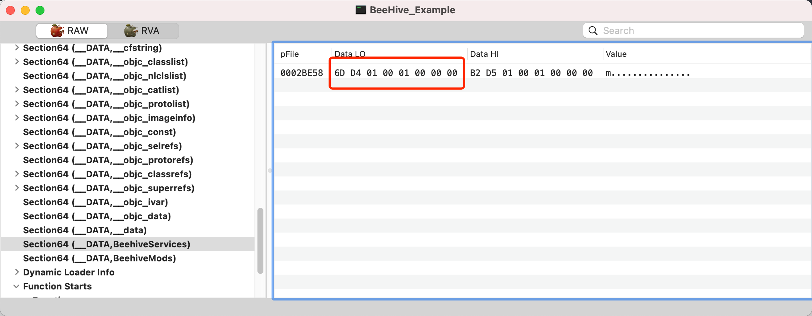
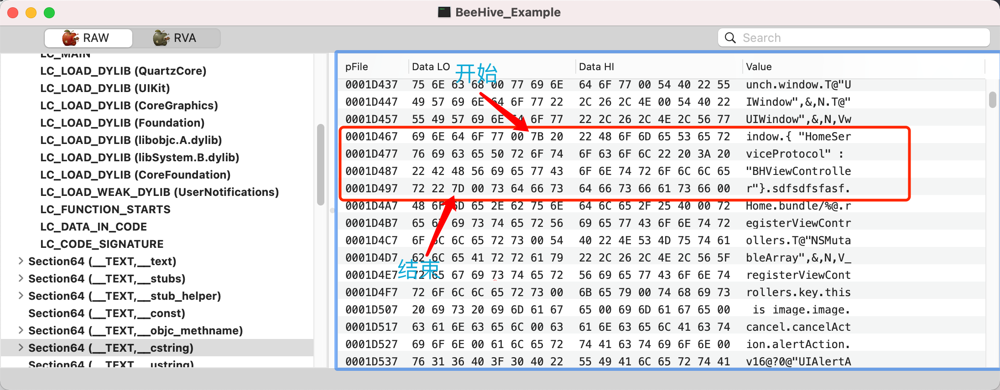

# Mach-O 学习小结（五）

最近学习了一下 Mach-O ,这里做个笔记记录，整理思路，加深理解。  

## 概述

[第一章](https://www.jianshu.com/p/fa5666308724) 描述了 Mach-O 文件的基本结构；  
[第二章](https://www.jianshu.com/p/92b4f611170a) 概述了符号，分析了符号表（symbol table）。  
[第三章](https://www.jianshu.com/p/9e4ccd3cb765) 探寻动态链接。  
[第四章](https://www.jianshu.com/p/c9445935b055) 分析fishhook。   
[第五章](https://www.jianshu.com/p/bad714ea8df7) 分析BeeHive。   
[第六章](https://www.jianshu.com/p/a174f17a9d82) App启动时间。


### BeeHive简介

`BeeHive`是用于`iOS`的`App`模块化编程的框架实现方案，吸收了`Spring`框架`Service`的理念来实现模块间的`API`耦合。

 [BeeHive github官方链接](https://github.com/alibaba/BeeHive)


## BeeHive源码分析

### BHAnnotation宏定义

```c
//BHAnnotation.h
#ifndef BeehiveModSectName
#define BeehiveModSectName "BeehiveMods"
#endif

#ifndef BeehiveServiceSectName
#define BeehiveServiceSectName "BeehiveServices"
#endif

#define BeeHiveDATA(sectname) __attribute((used, section("__DATA,"#sectname" ")))

#define BeeHiveMod(name) \
class BeeHive; char * k##name##_mod BeeHiveDATA(BeehiveMods) = ""#name"";

#define BeeHiveService(servicename,impl) \
class BeeHive; char * k##servicename##_service BeeHiveDATA(BeehiveServices) = "{ \""#servicename"\" : \""#impl"\"}";
```

这是BeeHive中最重要的几个宏定义，对外主要使用`BeeHiveMod(name)`和`BeeHiveService(servicename,impl)`。这里以`BeeHiveService(servicename,impl)`为例来讲。

```
#： 在宏定义中，将其后的变量，转化为字符串。
## ： 在宏定义中，将其前后的两个变量拼接在一起。
```

将宏定义展开

```c
// eg: servicenameProtocol为协议，servicenameImp为实现协议的类
@BeeHiveService(servicenameProtocol,servicenameImp) 
// 可以展开为如下：
@class BeeHive; char * kservicenameProtocol_service BeeHiveDATA(BeehiveServices) = "{ \"""servicenameProtocol""\" : \"""servicenameImp""\"}";
// 再展开BeeHiveDATA(BeehiveServices)：
@class BeeHive; char * kservicenameProtocol_service __attribute((used, section("__DATA,""BeehiveServices"" "))) = "{ \"""servicenameProtocol""\" : \"""servicenameImp""\"}";
// 在C语音中 "abc"也可以写成 "a""b"c",即相连的字符串可以合并，这里合并字符串
@class BeeHive; char * kservicenameProtocol_service __attribute((used, section("__DATA, BeehiveServices "))) = "{ \"servicenameProtocol\" : \"servicenameImp\"}";
```

这里可以看到，其实这个宏就是声明了一个字符串变量。`class BeeHive;`的用处，是可以在使用宏的时候，前面要拼`@`。

这里重要的是`__attribute((used, section("__DATA, BeehiveServices ")))`，\_\_attribute第一个参数used。被used修饰以后，意味着即使符号没有被引用，在Release下也不会被优化。如果不加这个修饰，那么Release环境链接器会去掉。

section("\_\_DATA, BeehiveServices ")标记这个被放在哪个section中，这里即为`__DATA segment`下的`BeehiveServices section`。

也就是说，这个宏的作用，声明了一个不会被优化掉的字符串变量，变量的内容为`"{ \"servicenameProtocol\" : \"servicenameImp\"}"`，该字符串存储在Mach-O文件`__DATA BeehiveServices section`中。

### Mach-O存储形式

字符串会被存储在`__TEXT segment, __cstring section`中，`__DATA BeehiveServices section`中存储的是指针，指向`__cstring`中的字符串。eg:

`@BeeHiveService(HomeServiceProtocol,BHViewController)`



可以看到指针指向0x010001D46D，换算成文件偏移地址，即：0x0001D46D，可以看到，正好落到`__cstring`中




### BHAnnotation实现

```c
static void dyld_callback(const struct mach_header *mhp, intptr_t vmaddr_slide);
NSArray<NSString *>* BHReadConfiguration(char *sectionName,const struct mach_header *mhp);

__attribute__((constructor)) //这里标记的方法，会在main函数之前被系统自动调用
void initProphet() {
    _dyld_register_func_for_add_image(dyld_callback); //添加image load的回调，和fishhook的一样
}

static void dyld_callback(const struct mach_header *mhp, intptr_t vmaddr_slide) //image load 的回调
{
    NSArray *mods = BHReadConfiguration(BeehiveModSectName, mhp); //从指定的section中取出数据
    for (NSString *modName in mods) {
        Class cls;
        if (modName) {
            cls = NSClassFromString(modName);
            
            if (cls) {
                [[BHModuleManager sharedManager] registerDynamicModule:cls];
            }
        }
    }
    
    //register services
    NSArray<NSString *> *services = BHReadConfiguration(BeehiveServiceSectName,mhp); //从指定的section中取出数据
    for (NSString *map in services) { //这里的map，即为上文中声明的json字符串 "{ \"servicenameProtocol\" : \"servicenameImp\"}"
        NSData *jsonData =  [map dataUsingEncoding:NSUTF8StringEncoding];
        NSError *error = nil;
        id json = [NSJSONSerialization JSONObjectWithData:jsonData options:0 error:&error];
        if (!error) {
            if ([json isKindOfClass:[NSDictionary class]] && [json allKeys].count) {
                //转成字典，出去 protocol 和 impClass
                NSString *protocol = [json allKeys][0];
                NSString *clsName  = [json allValues][0];
                
                if (protocol && clsName) {
                  //将协议和实现类注册到 BHServiceManager
                    [[BHServiceManager sharedManager] registerService:NSProtocolFromString(protocol) implClass:NSClassFromString(clsName)];
                }
                
            }
        }
    }
    
}

//读取指定section中的内容
NSArray<NSString *>* BHReadConfiguration(char *sectionName,const struct mach_header *mhp)
{
    NSMutableArray *configs = [NSMutableArray array];
    unsigned long size = 0;
#ifndef __LP64__
    uintptr_t *memory = (uintptr_t*)getsectiondata(mhp, SEG_DATA, sectionName, &size);
#else
    const struct mach_header_64 *mhp64 = (const struct mach_header_64 *)mhp;
    // 获取 __DATA segment 指定 sectionName的 内存地址
    uintptr_t *memory = (uintptr_t*)getsectiondata(mhp64, SEG_DATA, sectionName, &size);
#endif
    // 遍历指定section，取出存储的字符串，返回
    unsigned long counter = size/sizeof(void*);
    for(int idx = 0; idx < counter; ++idx){
        char *string = (char*)memory[idx]; 
        NSString *str = [NSString stringWithUTF8String:string];
        if(!str)continue;
        
        BHLog(@"config = %@", str);
        if(str) [configs addObject:str];
    }
    
    return configs;
}

```

这里我们可以看到，通过宏定义声明的协议和类，会在程序启动，加载image的时候，被从Mach-O文件中读取到，然后被自动注册到`BHServiceManager`类中。通过这种方式，即可方便的将协议和实现类绑定。


### BHServiceProtocol

这是BeeHive内部的一个协议，主要在创建实现类的实例的时候，用来判断是否需要创建单例。

```objective-c
@protocol BHServiceProtocol <NSObject>
@optional
+ (BOOL)singleton;
+ (id)shareInstance;
@end
```


### BHServiceManager

```objective-c
#import <Foundation/Foundation.h>

@class BHContext;

@interface BHServiceManager : NSObject

@property (nonatomic, assign) BOOL  enableException;

+ (instancetype)sharedManager;
- (void)registerLocalServices;
- (void)registerService:(Protocol *)service implClass:(Class)implClass;

- (id)createService:(Protocol *)service;
- (id)createService:(Protocol *)service withServiceName:(NSString *)serviceName;
- (id)createService:(Protocol *)service withServiceName:(NSString *)serviceName shouldCache:(BOOL)shouldCache;

- (id)getServiceInstanceFromServiceName:(NSString *)serviceName;
- (void)removeServiceWithServiceName:(NSString *)serviceName;

@end
```

这里只重点说几个方法：

```objective-c
// 上文中的注册方法，将协议及对应的实现类绑定
- (void)registerService:(Protocol *)service implClass:(Class)implClass
{
    NSParameterAssert(service != nil);
    NSParameterAssert(implClass != nil);
    // 判断类是否实现协议
    if (![implClass conformsToProtocol:service]) {
        if (self.enableException) {
            @throw [NSException exceptionWithName:NSInternalInconsistencyException reason:[NSString stringWithFormat:@"%@ module does not comply with %@ protocol", NSStringFromClass(implClass), NSStringFromProtocol(service)] userInfo:nil];
        }
        return;
    }
    
    //判断协议是否已经被注册绑定
    if ([self checkValidService:service]) {
        if (self.enableException) {
            @throw [NSException exceptionWithName:NSInternalInconsistencyException reason:[NSString stringWithFormat:@"%@ protocol has been registed", NSStringFromProtocol(service)] userInfo:nil];
        }
        return;
    }
    
    NSString *key = NSStringFromProtocol(service);
    NSString *value = NSStringFromClass(implClass);
    
  	//将协议和类，存储为key value键值对
    if (key.length > 0 && value.length > 0) {
        [self.lock lock];
        [self.allServicesDict addEntriesFromDictionary:@{key:value}]; 
        [self.lock unlock];
    }
}

```

这个方法也简单，其实就是用字典将 协议和类 存储起来，方便将来通过协议拿到对应的类。

```objective-c
- (id)createService:(Protocol *)service
{
    return [self createService:service withServiceName:nil];
}

- (id)createService:(Protocol *)service withServiceName:(NSString *)serviceName {
    return [self createService:service withServiceName:serviceName shouldCache:YES];
}

- (id)createService:(Protocol *)service withServiceName:(NSString *)serviceName shouldCache:(BOOL)shouldCache {
    if (!serviceName.length) {
        serviceName = NSStringFromProtocol(service);
    }
    id implInstance = nil;
    
    //判断当前协议是否被注册
    if (![self checkValidService:service]) {
        if (self.enableException) {
            @throw [NSException exceptionWithName:NSInternalInconsistencyException reason:[NSString stringWithFormat:@"%@ protocol does not been registed", NSStringFromProtocol(service)] userInfo:nil];
        }
        
    }
    
    //判断是否使用缓存，缓存的key，如果不传，即使用协议名做key。
    NSString *serviceStr = serviceName;
    if (shouldCache) {
        id protocolImpl = [[BHContext shareInstance] getServiceInstanceFromServiceName:serviceStr];
        //命中缓存，直接返回对应的实例
        if (protocolImpl) {
            return protocolImpl;
        }
    }
    
    Class implClass = [self serviceImplClass:service]; // 根据协议找到对应的实现类
    //判断实现类是否需要创建单例，如果开启了缓存，还会被缓存起来。
    if ([[implClass class] respondsToSelector:@selector(singleton)]) {
        if ([[implClass class] singleton]) {
            if ([[implClass class] respondsToSelector:@selector(shareInstance)])
                implInstance = [[implClass class] shareInstance];
            else
                implInstance = [[implClass alloc] init];
            if (shouldCache) {
                [[BHContext shareInstance] addServiceWithImplInstance:implInstance serviceName:serviceStr];
                return implInstance;
            } else {
                return implInstance;
            }
        }
    }
    //不需要单例，则直接实例化一个实现类的实例返回
    return [[implClass alloc] init];
}

```

这几个方法，其实也就是根据对应的协议，取出对应的实例，是否是单例也由是否实现具体的方法来决定。

### 小结

很多同学好奇，这样做有什么用处呢？绕来绕去，还不如我直接实例化对应的实例，调用对应的方法呢。

其实不然，这样之后，我们就可以将对指定类的依赖，改为对指定协议的依赖，也就实现了模块间的解耦。

举个栗子：

```objective-c
// AAA模块
@interface AAAModule : NSObject
- (void)printAAA;
@end

@implementation AAAModule
- (void)printAAA{
    NSLog(@"AAAModule");
}
@end

// BBB模块
@interface BBBModule : NSObject
- (void)printBBB;
@end

#import "AAAModule.h"
@implementation AAAModule
- (void)printAAA{
    AAAModule *m = [[AAAModule alloc] init];
    [m printAAA];
}
@end
```

这里我们看到，B模块对A模块有强依赖，如果这个时候，我们有需求，需要下掉AAA模块，那么BBB模块就需要跟着一起改动，否则就会编译报错。图中的例子比较简单，实际中，往往可能需要改动成百的接口。更令人崩溃的是，过几天之后，产品又想把功能添加回来，又一次大动干戈。一想就都是泪。。。

但是如果我们使用BeeHive 改造之后:

```objective-c
// 抽出一个新的模块，专门的一个协议模块，用来存储各个模块的对外协议，这里就叫CCC模块
// 这里将需要对外暴露的方法抽成一个协议
// CCCModule.h
@protocol AAAModuleService <BHServiceProtocol>
- (void)printAAA; //将AAA模块需要对外暴露的方法，放到协议中
@end


// AAA模块
@interface AAAModule : NSObject
- (void)printAAA;
@end

//注意这里的改动，声明协议和类绑定 
@BeeHiveService(AAAModuleService,AAAModule)
@interface AAAModule() <AAAModuleService> //声明协议
@end  
@implementation AAAModule
- (void)printAAA{ //实现协议
    NSLog(@"AAAModule");
}
@end
  
// BBB模块
@interface BBBModule : NSObject
- (void)printBBB;
@end

#import "CCCModule.h"
#import "BeeHive"
@implementation AAAModule
- (void)printAAA{
    id<AAAModuleService> m = [[BHServiceManager sharedManager] createService:@protocol(AAAModuleService)];
  	if (m) {
        [m printAAA];
    }
}
@end
```

这里我们就将BBB模块对 AAA模块的依赖拆开，现在BBB模块依赖CCC模块，AAA模块一样依赖CCC模块。有同学就提出疑问了，你这样做有什么用？虽然解除了对AAA模块的依赖，但是又添加了CCC模块的依赖，而且代码还复杂了一些。

其实不然，因为CCC模块只是一层协议层，里面只有各个模块的对外协议，并不涉及具体的实现。所以CCC模块不依赖任何其他业务模块，即CCC模块不耦合业务。这样当我们需要下掉AAA模块的时候，直接去除对应的模块即可。CCC、BBB模块不需要任何的改动。

这在做大型项目的组件化时，是非常重要的，配合Cocoapod使用，引入对应pod组件，就可以实现对应功能。删掉对应pod组件，就下掉对应功能。真正意义上的实现组件的效果。


