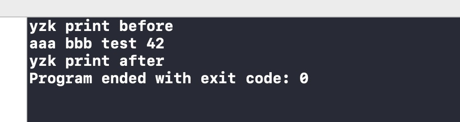

# Mach-O 学习小结（四）

最近学习了一下 Mach-O ,这里做个笔记记录，整理思路，加深理解。  

附上下文所用[demo](https://github.com/whlpkk/Mach)

## 概述

[第一章](https://www.jianshu.com/p/fa5666308724) 描述了 Mach-O 文件的基本结构；  
[第二章](https://www.jianshu.com/p/92b4f611170a) 概述了符号，分析了符号表（symbol table）。  
[第三章](https://www.jianshu.com/p/9e4ccd3cb765) 探寻动态链接。  
[第四章](https://www.jianshu.com/p/c9445935b055) 分析fishhook。   
[第五章](https://www.jianshu.com/p/bad714ea8df7) 分析BeeHive。    
[第六章](https://www.jianshu.com/p/a174f17a9d82) App启动时间。

 

### Fishhook简介

关于 fishhook，[官方资料](https://github.com/facebook/fishhook)是这么介绍的：

> fishhook is a very simple library that enables dynamically rebinding symbols in Mach-O binaries running on iOS in the simulator and on device.

简单来说，通过 fishhook，可以对动态链接的符号进行重新绑定。


## Fishhook源码分析

### Fishhook接口

从 fishhook.h 的 API 上看，它定义了两个函数：

``` objective-c
struct rebinding {
  const char *name;  // 目标符号名
  void *replacement; // 要替换的符号值（地址值）
  void **replaced;   // 用来存放原来的符号值（地址值）
};

// 操作的对象是进程的所有镜像（image）
int rebind_symbols(struct rebinding rebindings[], size_t rebindings_nel);

// 操作的对象是某个指定的镜像（image）
int rebind_symbols_image(void *header,
                         intptr_t slide,
                         struct rebinding rebindings[],
                         size_t rebindings_nel);
```

一般都只是使用前者。本文也只是对`rebind_symbols()`展开进一步描述，它有两参数，`rebindings`是一个`rebinding`数组，`rebindings_nel`描述数组的长度。


### Fishhook Example

举例描述 fishhook 的使用，这个 case 要做的事情是重定位`printf`函数的符号，让它指向到自定义函数，代码如下：

```objective-c
// main.c

#include <stdio.h>
#include <stdarg.h>
#include "fishhook.h"

static int (*ori_printf)(const char *, ...);

int yzk_printf(const char *format, ...)
{
    int ret = 0;
    ori_printf("yzk print before\n");
    va_list arg;
    va_start(arg, format);
    ret = vprintf(format, arg);
    va_end(arg);
    ori_printf("yzk print after\n");
    return ret;
}

int main(void)
{
    // rebind `printf` 符号，让它指向到自定义的 `yzk_printf` 函数
    struct rebinding printf_rebinding = { "printf", yzk_printf, (void *)&ori_printf };
    rebind_symbols((struct rebinding[1]){printf_rebinding}, 1);
    
    // 调用 `printf`，实际执行的逻辑是 `god_printf` 定义的逻辑
    printf("aaa bbb test %d\n", 42);
    return 0;
}
```


运行程序：



可以看到，结果和预期一样，对`printf`的调用，实际上执行的是`yzk_printf()`。


### rebind_symbols_for_image

fishhook.c 简短的源码中，执行 rebind 逻辑的核心函数有两个：`rebind_symbols_for_image`和`perform_rebinding_with_section`；前者负责找到目标 section，后者在 section 里根据符号进行真正的 rebind。

先看`rebind_symbols_for_image`，代码如下：

```c
static void rebind_symbols_for_image(struct rebindings_entry *rebindings,
                                     const struct mach_header *header,
                                     intptr_t slide) {
  Dl_info info;
  if (dladdr(header, &info) == 0) {
    return;
  }

  segment_command_t *cur_seg_cmd;
  segment_command_t *linkedit_segment = NULL;
  struct symtab_command* symtab_cmd = NULL;
  struct dysymtab_command* dysymtab_cmd = NULL;

  uintptr_t cur = (uintptr_t)header + sizeof(mach_header_t); //command起始地址
  for (uint i = 0; i < header->ncmds; i++, cur += cur_seg_cmd->cmdsize) { //遍历header下所有的command
    cur_seg_cmd = (segment_command_t *)cur;  //当前遍历到的 command
    if (cur_seg_cmd->cmd == LC_SEGMENT_ARCH_DEPENDENT) { 
      //如果 command 是 LC_SEGMENT_64 或 LC_SEGMENT（依赖cpu架构，后文都以64位举例）
      if (strcmp(cur_seg_cmd->segname, SEG_LINKEDIT) == 0) { 
        // 当前 command 为 LC_SEGMENT_64（__LINKEDIT） 
        linkedit_segment = cur_seg_cmd;
      }
    } else if (cur_seg_cmd->cmd == LC_SYMTAB) {
      // 当前 command 为 LC_SYMTAB
      symtab_cmd = (struct symtab_command*)cur_seg_cmd;
    } else if (cur_seg_cmd->cmd == LC_DYSYMTAB) {
      // 当前 command 为 LC_DYSYMTAB
      dysymtab_cmd = (struct dysymtab_command*)cur_seg_cmd;
    }
  }

  if (!symtab_cmd || !dysymtab_cmd || !linkedit_segment ||
      !dysymtab_cmd->nindirectsyms) {
    return;
  }

  // Find base symbol/string table addresses
  uintptr_t linkedit_base = (uintptr_t)slide + linkedit_segment->vmaddr - linkedit_segment->fileoff; //获取LINK段基虚拟内存地址
  nlist_t *symtab = (nlist_t *)(linkedit_base + symtab_cmd->symoff); //获取符号表虚拟内存地址
  char *strtab = (char *)(linkedit_base + symtab_cmd->stroff);  //获取string table虚拟内存地址

  // Get indirect symbol table (array of uint32_t indices into symbol table)
  uint32_t *indirect_symtab = (uint32_t *)(linkedit_base + dysymtab_cmd->indirectsymoff); //获取间接符号表虚拟内存地址

  cur = (uintptr_t)header + sizeof(mach_header_t);
  for (uint i = 0; i < header->ncmds; i++, cur += cur_seg_cmd->cmdsize) {
    cur_seg_cmd = (segment_command_t *)cur;
    if (cur_seg_cmd->cmd == LC_SEGMENT_ARCH_DEPENDENT) {
      // 过滤 segment，只在 __DATA、__DATA_CONST segment 里寻找
      if (strcmp(cur_seg_cmd->segname, SEG_DATA) != 0 &&
          strcmp(cur_seg_cmd->segname, SEG_DATA_CONST) != 0) {
        continue;
      }
      // 在 segment 中，遍历寻找指定section
      for (uint j = 0; j < cur_seg_cmd->nsects; j++) {
        section_t *sect =
          (section_t *)(cur + sizeof(segment_command_t)) + j;
        if ((sect->flags & SECTION_TYPE) == S_LAZY_SYMBOL_POINTERS) {
          // 找到后，执行 `perform_rebinding_with_section()`修改对应section中的内容
          perform_rebinding_with_section(rebindings, sect, slide, symtab, strtab, indirect_symtab);
        }
        if ((sect->flags & SECTION_TYPE) == S_NON_LAZY_SYMBOL_POINTERS) {
          perform_rebinding_with_section(rebindings, sect, slide, symtab, strtab, indirect_symtab);
        }
      }
    }
  }
}

```

可以看到，fishhook 通过 section type 匹配来寻找目标 section，前文介绍了 section 结构体，其中有一个`flags`字段，该字段含有描述 section type 的信息，如下罗列了上文 main.out 的`__nl_symbol_ptr`、`__got`、`__la_symbol_ptr`的`flags`值信息：

```text
Section
  sectname __nl_symbol_ptr
   segname __DATA
     flags 0x00000006

Section
  sectname __got
   segname __DATA
     flags 0x00000006

Section
  sectname __la_symbol_ptr
   segname __DATA
     flags 0x00000007
```

0x06、0x07 分别对应的宏是`S_NON_LAZY_SYMBOL_POINTERS`、`S_LAZY_SYMBOL_POINTERS`，前者指该 section 用于存储 non-lazy 型符号地址信息，后者指该 section 用于存储 lazy 型符号地址信息。

至此，可以得到两点重要信息。

其一，fishhook 寻找`__la_symbol_ptr`等 section 的逻辑并不是通过 name 匹配，而是通过 section type 匹配。

其二，fishhook rebind 的对象不光是函数型符号，还包括数据型符号，因为可以修改\_\_got section。


### perform_rebinding_with_section

 最后，再看看`perform_rebinding_with_section`：

 ```c
 static void perform_rebinding_with_section(struct rebindings_entry *rebindings,
                                            section_t *section,
                                            intptr_t slide,
                                            nlist_t *symtab,
                                            char *strtab,
                                            uint32_t *indirect_symtab) {
   // indirect_symtab 是一个 uint32_t 的索引数组，section->reserved1即为当前section在indirect_symtab表中第一个的索引
   uint32_t *indirect_symbol_indices = indirect_symtab + section->reserved1;
   // 当前section(S_NON_LAZY_SYMBOL_POINTERS、S_LAZY_SYMBOL_POINTERS) 数据，section中每条都是一个指针
   void **indirect_symbol_bindings = (void **)((uintptr_t)slide + section->addr);
   // 遍历 section 中每个指针
   for (uint i = 0; i < section->size / sizeof(void *); i++) {
     uint32_t symtab_index = indirect_symbol_indices[i]; //从indirect_symtab取出 符号表的索引
     if (symtab_index == INDIRECT_SYMBOL_ABS || symtab_index == INDIRECT_SYMBOL_LOCAL ||
         symtab_index == (INDIRECT_SYMBOL_LOCAL   | INDIRECT_SYMBOL_ABS)) {
       //过滤INDIRECT_SYMBOL_ABS和INDIRECT_SYMBOL_LOCAL
       continue;
     }
     uint32_t strtab_offset = symtab[symtab_index].n_un.n_strx; //根据symtab_index，从符号表取出对应符号，获取在string table中的偏移量
     char *symbol_name = strtab + strtab_offset; // 从string table中，根据偏移量取出对应的符号名
     // 遍历需要 Hook 的链表
     struct rebindings_entry *cur = rebindings;
     while (cur) {
       for (uint j = 0; j < cur->rebindings_nel; j++) {
         // 判断符号名是否相等，它把符号真正的 name 的第一个字符给去掉了，所以上文匹配printf对应的符号时，符号名无需写成_printf
         if (strlen(symbol_name) > 1 &&
             strcmp(&symbol_name[1], cur->rebindings[j].name) == 0) {
           if (cur->rebindings[j].replaced != NULL &&
               indirect_symbol_bindings[i] != cur->rebindings[j].replacement) {
             *(cur->rebindings[j].replaced) = indirect_symbol_bindings[i]; //将旧符号地址写入replaced
           }
           indirect_symbol_bindings[i] = cur->rebindings[j].replacement; // 将新符号地址写入section中
           goto symbol_loop;
         }
       }
       cur = cur->next;
     }
   symbol_loop:;
   }
 }
 ```


 ## 小结

结合上文的分析，对 fishhook 做个小结：

- fishhook 能 hook 的符号必须存在于动态库中，换句话说，它无法对本地符号进行 hook
- fishhook 既能处理函数型符号，也能处理数据型符号（无论是全局变量还是全局常量）
- 使用 fishhook 处理符号时，传参中的符号名并不是真正的符号名，譬如你想对`_printf`符号进行 rebind，传入`"printf"`即可

 

## Fishhook的问题

 Fishhook 会在 14.5 以上的 iOS 系统且 A12 芯片的设备上必崩溃。原因在于 

```c
indirect_symbol_bindings[i] = cur->rebindings[j].replacement; // 将新符号地址写入section中
```

这一步，fishhook 直接用赋值进行内存写操作，如果遇到内存没有写权限时候，就会直接崩溃。低版本上的`__DATA_CONST` section映射的内存是可读写的，所以不会触发。在iOS 14.5 beta上发现大部分变成了只读，当赋值时即会崩溃。 

修复为：

```c
// 获取指定内存的读写权限
static vm_prot_t get_protection(void *sectionStart) {
  mach_port_t task = mach_task_self();
  vm_size_t size = 0;
  vm_address_t address = (vm_address_t)sectionStart;
  memory_object_name_t object;
#ifdef __LP64__
  mach_msg_type_number_t count = VM_REGION_BASIC_INFO_COUNT_64;
  vm_region_basic_info_data_64_t info;
  kern_return_t info_ret = vm_region_64(
      task, &address, &size, VM_REGION_BASIC_INFO_64, (vm_region_info_64_t)&info, &count, &object);
#else
  mach_msg_type_number_t count = VM_REGION_BASIC_INFO_COUNT;
  vm_region_basic_info_data_t info;
  kern_return_t info_ret = vm_region(task, &address, &size, VM_REGION_BASIC_INFO, (vm_region_info_t)&info, &count, &object);
#endif
  if (info_ret == KERN_SUCCESS) {
    return info.protection;
  } else {
    return VM_PROT_READ;
  }
}

static void perform_rebinding_with_section(struct rebindings_entry *rebindings,
                                           section_t *section,
                                           intptr_t slide,
                                           nlist_t *symtab,
                                           char *strtab,
                                           uint32_t *indirect_symtab) {
  const bool isDataConst = strcmp(section->segname, SEG_DATA_CONST) == 0;
  const bool isAuthConst = strcmp(section->segname, SEG_AUTH_CONST) == 0;
  uint32_t *indirect_symbol_indices = indirect_symtab + section->reserved1;
  void **indirect_symbol_bindings = (void **)((uintptr_t)slide + section->addr);
  vm_prot_t oldProtection = VM_PROT_READ;
  vm_size_t trunc_address = (vm_size_t)indirect_symbol_bindings;
  vm_size_t trunc_size = 0;
  if (isDataConst || isAuthConst) { // 如果是__DATA_CONST section 或 __AUTH_CONST section,处理权限
    trunc_address = trunc_page((vm_size_t)indirect_symbol_bindings); //mprotect 函数一直要求页对齐，这里进行页对齐
    trunc_size =(vm_size_t)indirect_symbol_bindings -trunc_address;
    pthread_mutex_lock(&mutex); //加锁，防止多线程时，权限判断错误，导致对只读内存进行写操作
    oldProtection = get_protection((void *)trunc_address); //保存旧的权限，操作完成后，恢复旧权限
    mprotect((void *)trunc_address, section->size+trunc_size, PROT_READ | PROT_WRITE); //将权限改完可读可写
  }
  for (uint i = 0; i < section->size / sizeof(void *); i++) {
    uint32_t symtab_index = indirect_symbol_indices[i];
    if (symtab_index == INDIRECT_SYMBOL_ABS || symtab_index == INDIRECT_SYMBOL_LOCAL ||
        symtab_index == (INDIRECT_SYMBOL_LOCAL | INDIRECT_SYMBOL_ABS)) {
      continue;
    }
    uint32_t strtab_offset = symtab[symtab_index].n_un.n_strx;
    char *symbol_name = strtab + strtab_offset;
    bool symbol_name_longer_than_1 = symbol_name[0] && symbol_name[1];
    struct rebindings_entry *cur = rebindings;
    while (cur) {
      for (uint j = 0; j < cur->rebindings_nel; j++) {
        if (symbol_name_longer_than_1 &&
            strcmp(&symbol_name[1], cur->rebindings[j].name) == 0) {
          if (cur->rebindings[j].replaced != NULL &&
              indirect_symbol_bindings[i] != cur->rebindings[j].replacement) {
            *(cur->rebindings[j].replaced) = indirect_symbol_bindings[i];
          }
          indirect_symbol_bindings[i] = cur->rebindings[j].replacement;
          goto symbol_loop;
        }
      }
      cur = cur->next;
    }
  symbol_loop:;
  }
  if (isDataConst || isAuthConst) {
    int protection = 0;
    if (oldProtection & VM_PROT_READ) {
      protection |= PROT_READ;
    }
    if (oldProtection & VM_PROT_WRITE) {
      protection |= PROT_WRITE;
    }
    if (oldProtection & VM_PROT_EXECUTE) {
      protection |= PROT_EXEC;
    }
    mprotect((void *)trunc_address, section->size+trunc_size, protection); //将权限复原
    pthread_mutex_unlock(&mutex); //解锁
  }
}


```

 
